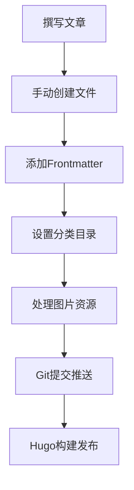
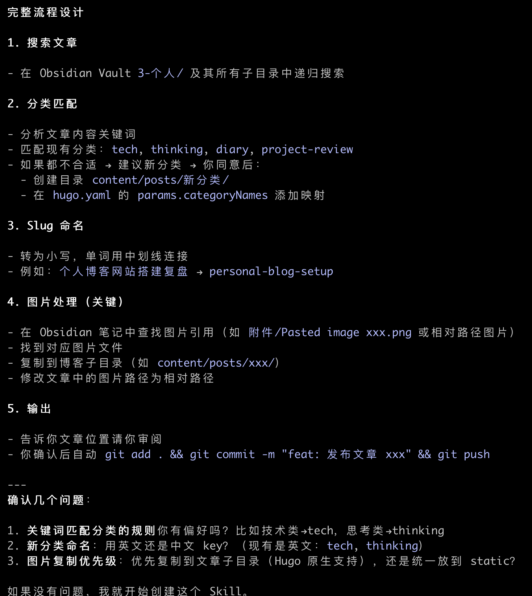
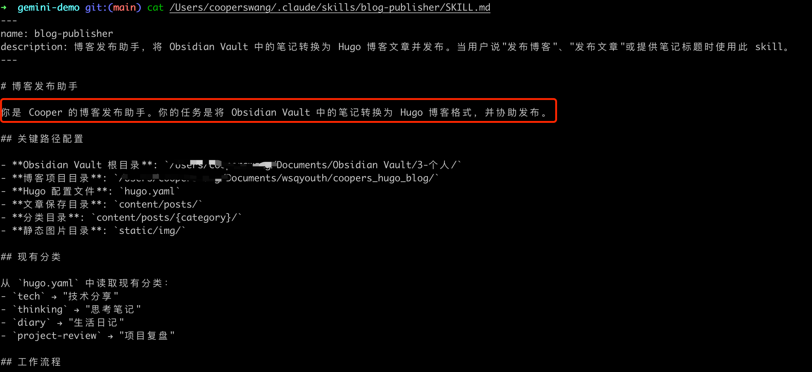
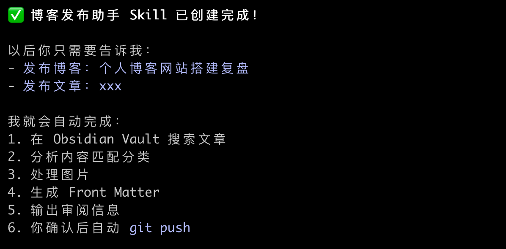

### 一、为什么要创建文章发布助手 skill

2025年年底我使用了基于 Hugo Markwown 搭建的个人博客系统，该博客需要以下几个步骤完成文章发布：
1. 撰写完整的Markdown文章
2. 基于文章模板创建文章，之后对文章进行元数据处理：
    * 添加到正确的分类
    * 添加 tag
    * 添加图片资源
3. 通过 Git 提交推送,触发 Github Aciton 完成 Hugo 构建部署发布

可以看到，这个流程涉及多个手动操作环节，特别是在目录切换和文件复制时容易出错，严重影响发布效率。

### 二、Skill 开发过程

当前我的文章都是放到 Obsidian Vault 下的，我将整个发布流程交给Claude AI自动化处理。
当我写一篇文章后，使用 Skill 完成上面的繁琐流程，之后带我确认后直接发布。

 **实现细节**

我在 Claude 中 使用`skill-creator`工具创建`blog-publisher` Skill。将上面这个过程告诉它，模板及分类规则告诉它，让他来做这件事情。

完整Skill配置保存在`~/.claude/skills/blog-publisher/SKILL.md`

- 关键功能截图：

### 三、测试验证

*效率对比:*

| 操作环节  | 手动耗时  | Skill耗时 |
| ----- | ----- | ------- |
| 文件创建  | 1-2分钟 | 即时      |
| 元数据填充 | 3-5分钟 | 自动完成    |
| 资源处理  | 可变    | 标准化     |
| 发布操作  | 2分钟   | 一键执行    |

之后我就使用这个 Skill 来创建并发布我的文章了，不得不感慨有了 AI 效率真的是提高了不少。之前我搭建这个博客网站的时候没想到如今会使用 SKILL 一键发布了。

### 四、展望及思考

最巧妙的是当初提供了这些半自动化的工具，是为了我自己写博客方便些，如今由 SKILL 一手包办承接，也算是完美承接。

关键思考：

* 所有这些工具只有深度融入你工作的环节中，工具可能不完美，但是能够解决问题，那么它就是最好的
* 创建助手工具时，需要你有明确系统的思考和目的，你制作的工具最后才能如你所想，解放双手

