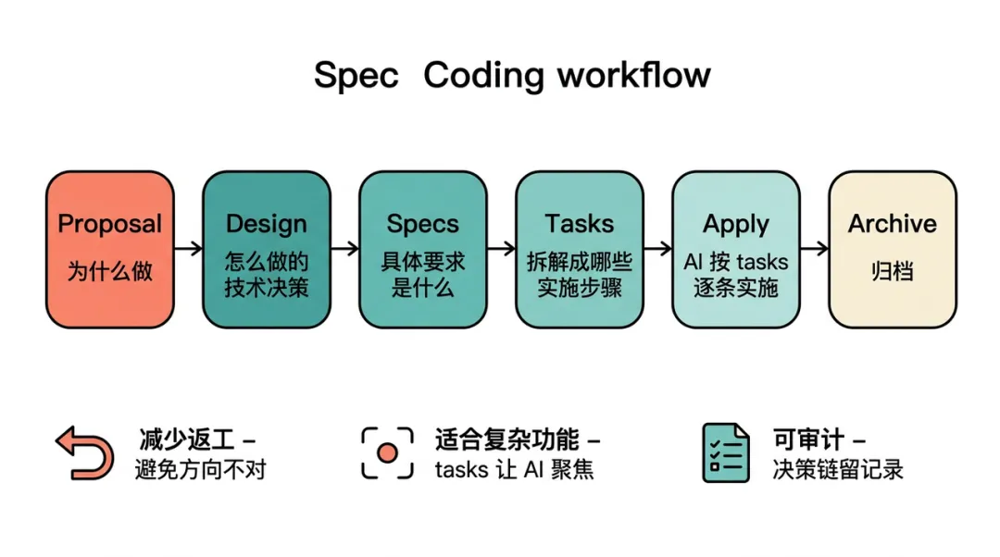

>1. 在自己的项目中使用了 Spec Coding，但需要更好的组织和复盘
>2. 参考了得物技术的分享文章：[AI 编程能力边界探索：基于 Claude Code 的 Spec Coding 项目实战｜得物技术](https://mp.weixin.qq.com/s/1Oi7YhMgcPp9gQAWPndXWA)，结合该文章对自己的项目进行了记录和复盘思考

### 一、概述
10 天时间，完成了 10,428 行代码的开发。基于 Claude Code 的 Spec Coding 方法，不仅实现了从 0 到 1 的前后端项目搭建，更学会了规范编程，摸清了 AI 编程的真实能力边界。
```shell
# 统计 Go/JS 文件行数，排除 frontend/node_modules 目录
find . -type f \( -name "*.go" -o -name "*.js" \) -not -path "./frontend/node_modules/*" -exec wc -l {} +
```

**什么是 Spec Coding**：在写代码之前，先编写规范文档。
**价值体现**：
- 减少返工
- 特别适合复杂功能开发，能让 AI 更聚焦当前 story 的实现
- 可审计性：每一个变更都有记录，方便审计


**AI 复盘**：可以让 Claude Code 对.jsonnl 会话文件进行整体数据统计，揭示 AI 的工作模式：xx 次文件读取、xx 次代码编辑、xx 次终端命令执行，以及 xx 次任务进度标记。（这个我没做，后续记得使用）

### 二、研发过程

1. **设计阶段**
   - PRD：对齐需求，也是后续 AI 生成代码的重要参考

2. **项目框架搭建**
   - 主要让 AI 充当架构师角色，围绕提供的框架要求完善技术栈、组件选型、代码架构设计等
   - 目标是搭建完整的项目框架，配置好开发环境，确保基本编译通过

3. **功能开发**
   - 开发强度最高的阶段
   - 引入 Spec Coding，先与 AI 共同定义清楚每个 story 的规范和方案
   - AI 基于这份"契约"完成编码

4. **调试与压测**
   - 重心转向功能迭代、系统重构和压测
   - 与 AI 协作完成已有功能优化：
     - 前端：例如添加邮箱账号切换功能，订单列表数据从 mock 数据改为调用真实后端接口
   - 后端：技术债务处理（部分接口字段格式不统一、json 字段设计不合理、异步消费架构设计问题）
   - 性能强化：通过压测和火焰图观测，修复暴露的问题

5. **生产环境部署**
   - 在云服务器安装 docker 及相关组件
   - 通过 scp 等方式上传本地二进制文件及配置文件
   - 安装 HTTPS 访问所需的证书
   - 经过与 AI 多轮分析，最终将整个功能部署上线

### 三、思考
整个 AI 开发过程中的关键点：
1. **CLAUDE.md 及相关文件**：需要渐进性加载，将规范、经验和开发流程规范放入其中，这样 AI 才能更理解需求
2. **示范文件提供**：在编写单元测试时，将之前的 TDD 编程示例提供给 AI 后，AI 能够按照参考完成所有核心文件的单元测试撰写

**遇到的问题**：

1. AI 会无条件服从，有时甚至过度阿谀奉承，需要保持警惕（例如你说有问题它就考虑有问题，你说好它就说好）
2. AI 设计的方案有时会过于繁杂臃肿，缺乏高质量工程师的代码品味（例如在添加链路追踪功能时，AI 最初设计了业务侵入严重的方案，直到明确指出"核心原则是进程内通过 context 传递，进程之间通过 body metadata 传递"，AI 才意识到开源库 OpenTelemetry 也采用类似思想）
3. AI 存在上下文丢失和压缩问题，目前还没有非常好的解决方案（提炼经验信息也会丢失）
4. 实测发现 Claude 的 CodeReview 能力不是很强，后续可以考虑尝试 Codex 或 ChatGPT 模型
