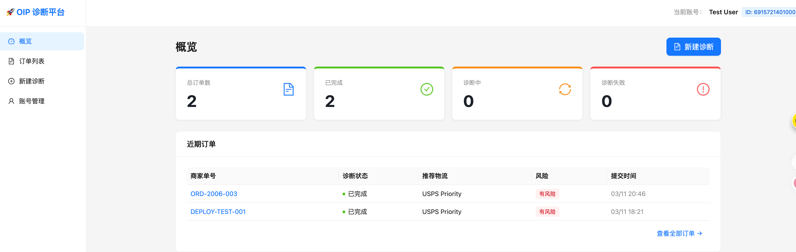
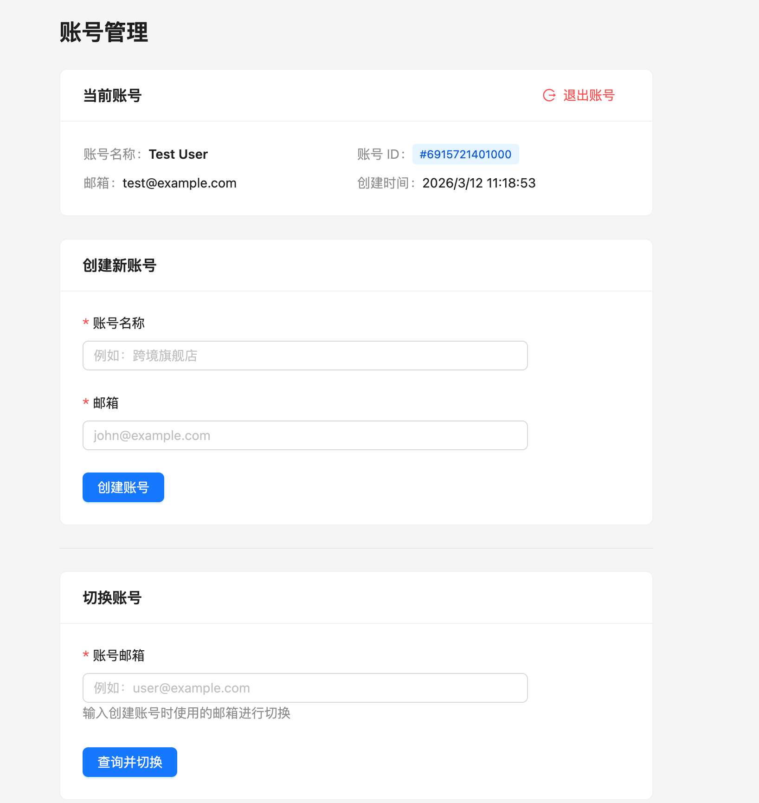
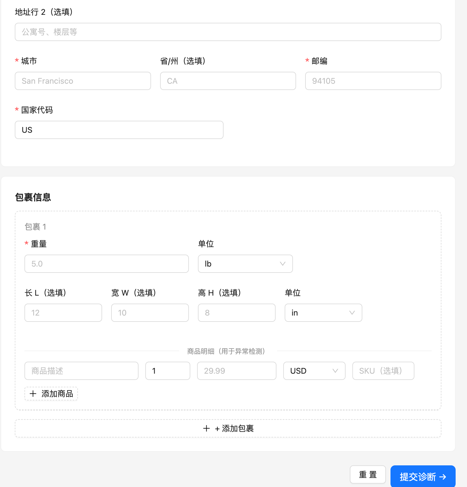
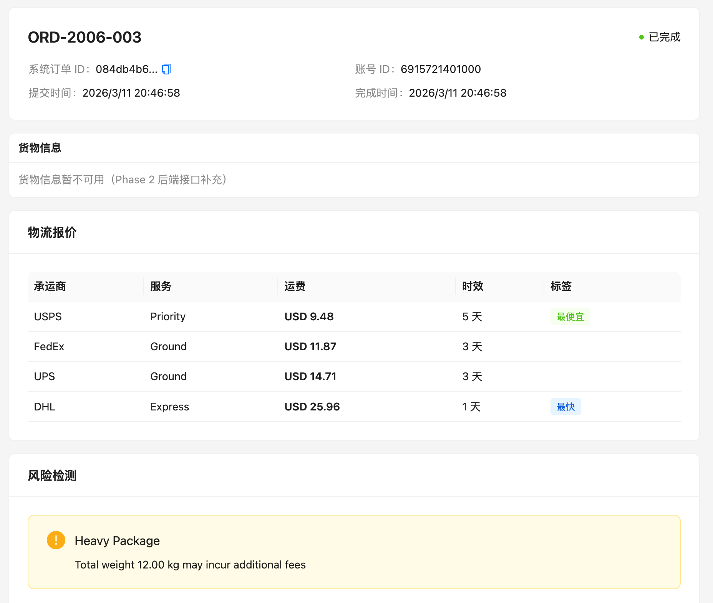
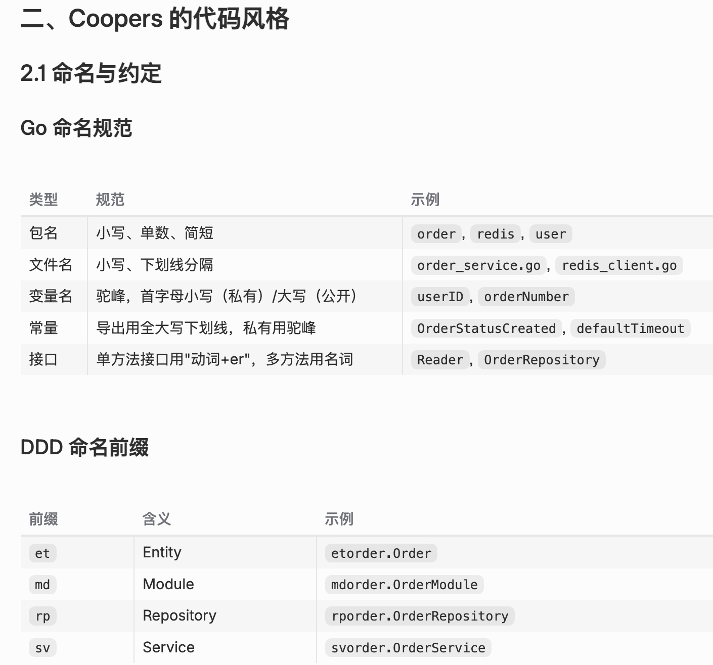
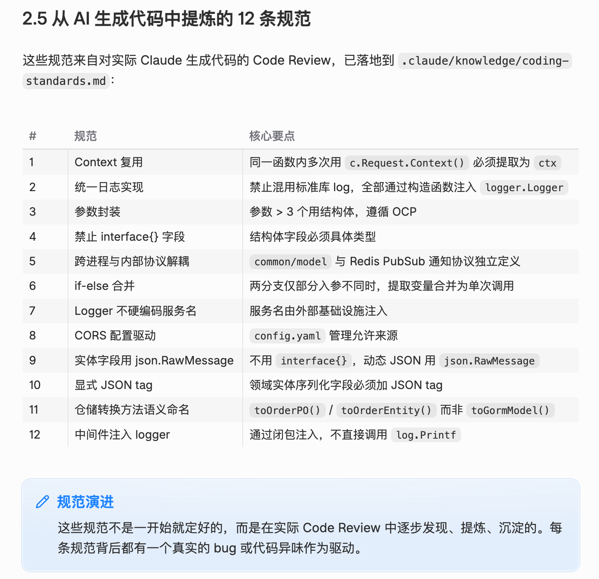

> 年前就一直想做一个前后端链路打通的作品，经过不断打磨，这个项目最近终于告一段落。在此做一个简单的复盘。

**目录**：

[项目背景](#一项目背景) 

[产品效果](#二产品效果)

[技术实现](#三技术实现) 

[收获成长](#四收获成长)

### 一、项目背景

**客户痛点**：中小卖家在进行跨境发货时，面临物流订单地址异常检测和物流商比价两大痛点，因此我做了一个轻量级的跨境订单智能诊断平台。

**产品优势**：
1. **轻量级**：市场上有类似系统，但需要付费购买庞大的 SaaS 应用，而客户往往只需要一个轻量的工具
2. **双端支持**：平台支持界面手动填写，也支持 API 接入（未来还可以封装为 MCP，供 AI 调用）
3. **即插即用**：客户只需理解一套标准接口即可快速接入，背后支持多家物流商的地址异常检测和费率、时效查询

从个人层面来说，我希望通过这样一个前后端打通的 MVP 作品，对整个系统设计有一个更深的认识。另外，现在 AI 编程能力已经很强，只要你思考得足够清晰，剩下的实现可以交给 AI。

### 二、产品效果

#### 2.1 平台界面

整个系统已部署到个人服务器：[**OIP 诊断平台**](https://oip.wsqyouth.cn/)，可登录 `test@example.com` 体验。

系统包含四个模块：概览、订单列表、新建诊断、账号管理。

1. **产品概览**
   客户故事：登录账号 → 新建物流订单 → 提交诊断 → 在订单列表查看诊断结果 → 通过概览了解整体诊断情况。
   

2. **客户注册及账号切换**
   
   为什么这么设计？因为海外用户主要以邮箱作为账号主体来处理业务，因此设计为通过邮箱切换账号，登录后即可查看该账号下的订单。

3. **新建诊断**
   
   客户填写订单信息后，由诊断平台执行诊断并返回结果。

4. **诊断结果页面**
   
   每个订单都会得到一份诊断结果：物流信息是否异常，以及当前这票快递可选的物流商有哪些，其中哪个服务最便宜、哪个最快。
   **备注**：当前物流商接口数据为 Mock 随机值，后续可接入真实物流商 API。

### 三、技术实现

**系统部署架构**：
```
用户浏览器 → https://oip.wsqyouth.cn
                  ↓
            Nginx (host, port 443)
            ├── /       → 前端静态文件
            └── /api/   → reverse proxy → 127.0.0.1:8080 (dpmain)

            dpmain (Go binary, host, :8080)
              ├── MySQL   (Docker, 127.0.0.1:3306)
              ├── Redis   (Docker, 127.0.0.1:6379)
              └── Lmstfy  (Docker, 127.0.0.1:7777)

            dpsync (Go binary, host)
```

**前端**基于 React 实现。这部分是我写好 PRD 后直接让 AI 实现的，我并不太熟悉前端，就不展开了。主要的设计考量是：路由、静态页面、业务逻辑这几块要分层，方便后续扩展。

**后端**系统技术架构如下：
```
┌─────────────────────────────────────────────────┐
│              用户/商家系统                        │
└──────────┬──────────────────────────┬───────────┘
           │ HTTP API                 │
           ↓                          │
    ┌──────────────┐                 │
    │   dpmain     │                 │
    │  (API 服务)   │                 │
    └──────┬───────┘                 │
           │                          │
           │ 1. 订阅 Redis            │ 4. 轮询查询
           │ 2. 推送 Lmstfy           │
           │ 3. Smart Wait (10s)      │
           ↓                          ↓
    ┌──────────────────────────────────────┐
    │  Redis Pub/Sub + MySQL              │
    │  channel: diagnosis:result:{id}     │
    └──────────────┬──────────────────────┘
                   ↑
                   │ 5. 发布结果
    ┌──────────────┴──────────┐
    │      dpsync             │
    │   (Worker 服务)          │
    │                         │
    │  CompositeHandler       │
    │  ├─ ShippingCalculator  │
    │  └─ AnomalyChecker      │
    └─────────────────────────┘
```

后端基于 Gin 框架，分为 API 服务（dpmain）和异步诊断服务（dpsync），通过 Lmstfy 消息队列解耦。这样设计的考量是：
* API 同步服务处理校验、耗时短的业务，将耗时较长的诊断环节放到异步任务中。
* 消息队列做解耦，一方面使业务架构更清晰，另一方面也为后续微服务拆分留好了扩展点。

**完整请求流程**：
```
1. 用户 → POST /api/v1/orders?wait=10
2. dpmain: 验证 account → 地址校验 → 订单落库 (DIAGNOSING)
3. dpmain: 订阅 Redis channel: diagnosis:result:{order_id}
4. dpmain: 推送 Lmstfy 队列：oip_order_diagnose
5. dpmain: Smart Wait 10s
   → 10s 内收到 Redis 消息 → 返回 200 + 诊断结果
   → 超时 → 返回 3001 + poll_url
```

**三个模块的职责划分**：

| 模块         | 职责                                              | 技术栈                      |
| ---------- | ----------------------------------------------- | ------------------------- |
| **common** | 共享内核：Entity + Model + DAO                       | GORM + Go 标准库            |
| **dpmain** | 同步 API：HTTP 接口 + Smart Wait + Callback Consumer | Gin + Wire + Redis       |
| **dpsync** | 异步 Worker：消费队列 + 执行诊断 + 发布回调             | Lmstfy + Template Method |

其中 dpmain 的核心架构采用 DDD，领域划分结构如下：
```
dpmain/internal/app/
├── domains/               # 领域层
│   ├── entity/           # et 前缀：聚合根和值对象
│   ├── apimodel/         # API 模型（DTO）
│   │   ├── request/      # XxxRequest
│   │   └── response/     # XxxResponse
│   ├── modules/          # md 前缀：业务编排
│   ├── repo/             # rp 前缀：仓储接口
│   └── services/         # sv 前缀：领域服务
├── infra/                # 基础设施层
│   ├── persistence/      # 持久化实现
│   └── mq/               # 消息队列
├── server/               # 服务器层
│   ├── handlers/         # HTTP 处理器
│   ├── routers/          # 路由配置
│   └── middlewares/      # 中间件
└── pkg/                  # 工具包
```

> [!important] 依赖方向核心原则
> **依赖指向领域层，领域层不依赖外部。**
> `server → services → modules + repo(接口) ← infra(实现)`

dpsync 是一个异步消费框架：订阅队列数据，多 Worker 并发消费处理，之后将结果回传或直接结束。主要设计考量：一是并发消费数量可配置化，灵活调节消费能力；二是扩展性好，后续新增的异步任务都能方便地接入。

总结核心设计决策：
1. **Shared Kernel 架构**：dpmain 和 dpsync 共处一个仓库，共用 Entity 层，适合 MVP 阶段快速迭代，同时保留了向微服务演进的可能性。
2. **Smart Wait + Redis Pub/Sub**：诊断请求先 Hold 住 API 连接，若 10s 内处理完成则直接返回 200 和诊断结果；否则返回 3001 和 poll_url，交由客户端异步轮询。这样既让客户有"伪同步"的实时体验，又避免长连接过多占用服务器资源。
3. **轻量级链路追踪**：仅 100 行 Go 代码实现，采样统计各环节耗时占比，方便后续监控优化。同一服务内通过 context 传播，跨服务通过 MQ metadata 传递 trace_id。

### 四、收获成长

#### 4.1 AI 编程开发

在这个项目中，我掌握了一套 SpecKit 编程范式——无论前端还是后端，与 AI 结对编程时都是先通过文档确定方案和协议，再进入代码开发。

典型开发流程：
```
1. 阅读 Story → 明确目标和验证标准
2. Plan 模式 → 与 Claude 对齐技术方案
3. Code 模式 → Claude 根据 knowledge/ 规范生成代码
4. Code Review → 人工审查，发现不符合规范的地方
5. 提炼规范 → 将 Review 发现的问题沉淀到 coding-standards.md
6. 更新 Story → 记录会话内容、决策、问题
```

在开发过程中，一方面对所有改动都通过文档留痕，方便复盘和回退；另一方面也在过程中不断沉淀经验和方法论到 Claude 的配置文档中，为后续项目积累可复用的知识。

下图是我让 AI 沉淀的一套编程经验：



#### 4.2 压测与调试

如果没有这个环节，充其量就是一个 MVP Demo。只有经过反复压测，才能知道系统的边界和薄弱项在哪里，最终打磨成可以发布到生产环境的产品。

两天的压测过程中发现了以下问题：
1. **日志量过大**：大量无用日志浪费资源，需要精简为关键信息
2. **连接池参数不合理**：高并发场景下没有使用池化复用连接，导致业务模块 CPU 占用不合理
3. **指标定义修正**：客户真正关心的是"快速且成功"，因此将指标定义为"3 秒内成功率"。这个指标一方面反映客户诉求，另一方面也倒逼我们持续提升系统性能
4. **回调队列的多线程化**：这个环节处于整个链路的末端，起初按多进程模型部署，后来优化为单线程合并到 dpmain（复用 DAO 并简化运维），没想到这里才是最大瓶颈。压测帮我发现了这个关键问题，多线程化后吞吐提升了 75%

### 五、总结展望

当然，距离真正的高并发系统还有很长的路要走。仅我能想到的不足就有：错误标准化、代码耦合优化、进一步性能调优、CI/CD 集成、云原生集群部署等。

但更重要的是，自己从头经历了一个项目的完整上线过程：原型设计 → 代码开发 → 压测调试 → 上云部署。对整个工程链路有了更深的认识。
