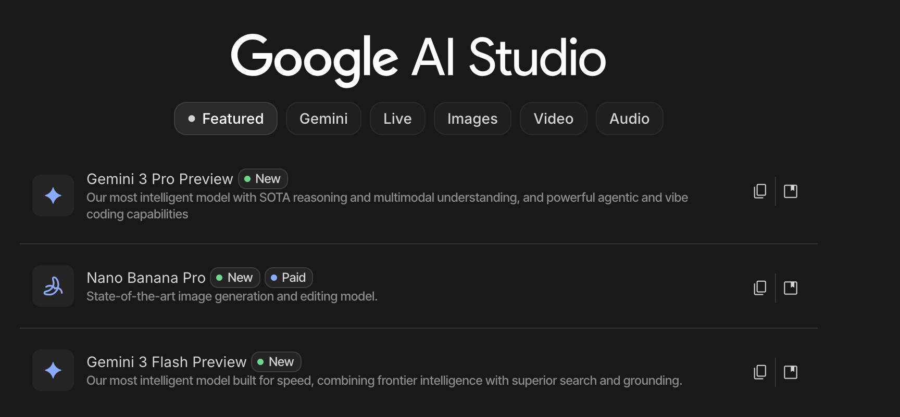

> Mac 下安装使用 Google Gemini CLI 及使用

<!--more-->


### 一、什么是 Gemini CLI

Gemini CLI 是由 Google Gemini 团队开源的一款命令行 AI 工具，专为开发者设计。它能够理解代码、执行复杂查询、自动化任务，并利用 Gemini 的多模态能力（如图像识别）生成创意内容。GitHub 地址：https://github.com/google-gemini/gemini-cli

主要功能亮点：

* 处理大型代码库 ：支持超过 100 万个 token 上下文长度，轻松分析大型项目。
* 多模态应用生成 ：通过 PDF 或草图快速生成应用程序原型。
* 自动化运维任务 ：如 Git 操作、PR 查询、代码迁移计划制定等。
* 集成外部工具 ：通过 MCP 服务器连接 Imagen、Veo、Lyria 等媒体生成模型。
* 联网搜索支持 ：内置 Google Search，确保回答基于最新信息。


### 二、Mac 下安装使用 Gemini CLI
```
1. 前提
node -v
2. 安装
npm install -g @google/gemini-cli
3. 启动
gemini
```

之后确认后会跳到浏览器让你登录，选一个谷歌账号来登录即可（需要科学上网）

如果需要通过 API 调用，则需要使用 API Key:

1. 在 [Google AI Studio](https://aistudio.google.com/apikey) 中获取 API Key。
2. 设置环境变量：
```
export GEMINI_API_KEY="YOUR_API_KEY"
```

### 三、学习路径
这里我主要使用了如下的方式进行研究：
1. 创建 google email 并完成实名认证
2. 找一些途径成功申请到了 goolge pro 一年的会员
3. 这样我就可以使用 Google 全家桶：Gemini, NotebookLLM, Antigravaity
4. 通过 Google 官方 API Doc 研究使用 [在线 URL](https://aistudio.google.com/app/prompts/new_chat?model=gemini-3-flash-preview), 可以体验最新的 Genini 3 Flash Preview 和 Nano Banana 

### 四、参考
1. [如何安装使用 Google Gemini CLI？](https://apifox.com/apiskills/how-to-use-google-gemini-cli/)
2. [Google Gemini API 接口调用教程](https://apifox.com/apiskills/how-to-use-gemini-api/)
3. [Google Gemini API 官方文档](https://ai.google.dev/gemini-api/docs/gemini-3?hl=zh-cn)