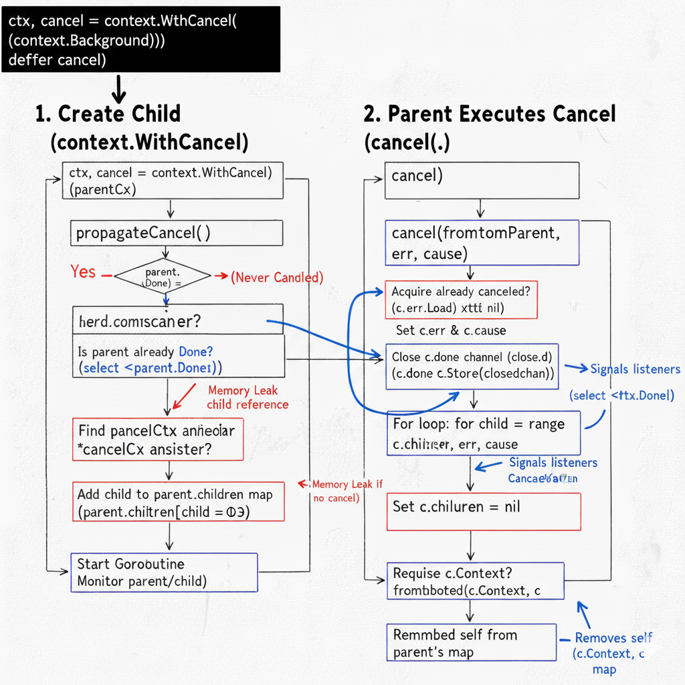

> Context 主要在异步场景下实现并发协调以及对 goroutine 的生命周期控制，同时间距一定的数据存储能力。

<!--more-->

### 一、核心数据结构

### 1.1 Context 接口

```
type Context interface {
    Deadline() (deadline time.Time, ok bool)
    Done() <-chan struct{}
    Err() error
    Value(key any) any
}
```

关注点：Done()` 返回 `<-chan struct{}，利用了 channel 关闭时的广播机制（所有监听者同时收到零值），非常适合 1 对 N 的通知场景。

思考：

* 为什么是 `struct{}`？因为空结构体不占内存。为什么是只读？防止使用者由外部向 channel 发送数据破坏逻辑。

### 1.2 emptyCtx - 树的根节点

```
type emptyCtx struct{}

func (emptyCtx) Deadline() (deadline time.Time, ok bool) { return }
func (emptyCtx) Done() <-chan struct{} { return nil }
func (emptyCtx) Err() error { return nil }
func (emptyCtx) Value(key any) any { return nil }
```

该结构体是 `Background` 和 `TODO` 的底层实现。

所有方法返回 nil 或 false。它永远无法被 Cancel，是所有 Context Tree 的根节点。

关注点：`Done()` 返回 `nil`，意味着读取 `nil` channel 会永久阻塞，因此 `emptyCtx` 永远无法被 cancel。


### 1.3 cancelCtx - 级联取消的核心
```
type cancelCtx struct {
    Context                   // Embedding: 继承父节点的 Value/Deadline
    mu       sync.Mutex       // 保护 children 和 err/cause
    done     atomic.Value     // 懒加载 channel，原子操作优化读性能
    children map[canceler]struct{} // Set 结构，存储子节点引用
    err      atomic.Value     // 记录取消原因
    cause    error            // 详细的取消原因 (Go 1.20+)
}
```

该结构体是理解 Context 级联取消的关键。

关注点：

* **children**：类型是 `map[canceler]struct{}`。
  * Key 是 `canceler` 接口（实现了 `cancel` 方法的 context），Value 是空结构体。这是为了建立父子树形关系，方便父节点取消时通知所有子节点。
  * 这是一个 Set。父节点只需要持有子节点的**指针**以便调用其 `cancel` 方法，不需要存任何值。
*  **done**：使用了 `atomic.Value`。
  * 这是为了优化 `Done()` 方法的性能。因为 `Done()` 会被高频调用（在 `for` 循环中），原子操作比互斥锁 (`mu.Lock`) 快得多
  * `Done()` 方法使用了 Double-Check locking 机制来实现懒加载，只有第一次调用时才创建 channel。

### 1.4 `timerCtx`-时间控制

```
type timerCtx struct {
    cancelCtx                 // 继承 cancelCtx 的所有能力（级联取消）
    timer *time.Timer         // 内部维护一个定时器
    deadline time.Time
}
```

**关注点**：`timerCtx` 只是对 `cancelCtx` 的封装。它通过 `time.AfterFunc` 在时间到达时调用 `cancel` 方法。

### 1.5 `valueCtx`-值传递
```
type valueCtx struct {
    Context
    key, val any
}

func value(c Context, key any) any {
    for {
        switch ctx := c.(type) {
        case *valueCtx:
            if key == ctx.key {
                return ctx.val
            }
            c = ctx.Context // 没找到，向父节点回溯
        case *cancelCtx:
            if key == &cancelCtxKey { return c } // 特殊后门，用于 propagateCancel 找父节点
            c = ctx.Context // cancelCtx 不存值，继续向上找
        case *timerCtx:
            if key == &cancelCtxKey { return &ctx.cancelCtx }
            c = ctx.Context
        case backgroundCtx, todoCtx:
            return nil // 根节点，查找结束
        default:
            return c.Value(key)
        }
    }
}
```
关注点：
这是一个链表，每次 WithValue 都在外层包一个新的 valueCtx。一个 valueCtx 实例只能存一个 kv 对，因此 n 个 kv 对会嵌套 n 个 valueCtx，造成空间浪费
链式查找：基于 k 查找时是一个 O(N) 的过程（N=层级深度）。
不支持基于 k 的去重，相同 k 可能重复存在，并基于起点的不同，返回不同的 v. 由此得知，valueContext 的定位类似于请求头，只适合存放少量作用域较大的全局 meta 数据.

### 二、Context 是如何把取消信号传递给子节点的？

问题：**父子节点如何建立联系？取消信号如何传播？**

业务代码使用方式:

```
ctx, cancel := context.WithCancel(context.Background())
defer cancel()
```

这两行代码主要有两个行为：创建 child ctx 和 执行 cancel


#### 2.1 创建 Child

当调用 context.WithCancel 时，源码内部核心逻辑在 `propagateCancel` 方法中

```
// propagateCancel arranges for child to be canceled when parent is.
// It sets the parent context of cancelCtx.
func (c *cancelCtx) propagateCancel(parent Context, child canceler) {
	c.Context = parent

	done := parent.Done()
	if done == nil {
		return // parent is never canceled
	}

	select {
	case <-done:
		// parent is already canceled
		child.cancel(false, parent.Err(), Cause(parent))
		return
	default:
	}

	if p, ok := parentCancelCtx(parent); ok {
		// parent is a *cancelCtx, or derives from one.
		p.mu.Lock()
		if err := p.err.Load(); err != nil {
			// parent has already been canceled
			child.cancel(false, err.(error), p.cause)
		} else {
			if p.children == nil {
				p.children = make(map[canceler]struct{})
			}
			p.children[child] = struct{}{}
		}
		p.mu.Unlock()
		return
	}

	if a, ok := parent.(afterFuncer); ok {
		// parent implements an AfterFunc method.
		c.mu.Lock()
		stop := a.AfterFunc(func() {
			child.cancel(false, parent.Err(), Cause(parent))
		})
		c.Context = stopCtx{
			Context: parent,
			stop:    stop,
		}
		c.mu.Unlock()
		return
	}

	goroutines.Add(1)
	go func() {
		select {
		case <-parent.Done():
			child.cancel(false, parent.Err(), Cause(parent))
		case <-child.Done():
		}
	}()
}
```

**源码流程解析：**

1. **快速检查**：如果 `parent.Done()` 为 `nil`（如 `Background`），说明父节点永不取消，子节点无需挂载，直接返回。
2. **父节点状态检查**：如果父节点已经 Done（channel 已关闭），子节点通过 `select case <-done` 立即感知并自我取消。
3. **寻找可挂载的祖先 (****parentCancelCtx****)**：

  ◦ Go 尝试通过 `parent.Value(&cancelCtxKey)` 找到最近的、内部实现的 `*cancelCtx`。
  ◦ 这是为了跳过那些只包含值但不具备取消能力的节点（如 `valueCtx`），直接把子节点挂到最近的“控制节点”上，优化树结构深度。

4. **加入 Map (Link)**：

  ◦ 如果找到祖先 `p`，加锁 `p.mu.Lock()`，将当前子节点加入父节点的 map 中：`p.children[child] = struct{}{}`。

  ◦ **目的**：让父节点持有子节点的引用，以便将来通知它。

 ◦ 这就是为什么如果不 cancel 子节点，且父节点存活较长，会导致子节点无法 GC（内存泄漏）的原因。

5. **外部 Context 兼容**：

  ◦ 如果父 Context 是用户自定义的（找不到 `*cancelCtx`），Go 会启动一个独立的 Goroutine 同时监听父子 channel：`case <-parent.Done(): child.cancel(...)`

#### 2.2 Parent 执行 Cancel

当 `cancelFunc` 被调用时，执行核心的 `cancel` 方法：

```
// cancel closes c.done, cancels each of c's children, and, if
// removeFromParent is true, removes c from its parent's children.
// cancel sets c.cause to cause if this is the first time c is canceled.
func (c *cancelCtx) cancel(removeFromParent bool, err, cause error) {
	if err == nil {
		panic("context: internal error: missing cancel error")
	}
	if cause == nil {
		cause = err
	}
	c.mu.Lock()
	if c.err.Load() != nil {
		c.mu.Unlock()
		return // already canceled
	}
	c.err.Store(err)
	c.cause = cause
	d, _ := c.done.Load().(chan struct{})
	if d == nil {
		c.done.Store(closedchan)
	} else {
		close(d)
	}
	for child := range c.children {
		// NOTE: acquiring the child's lock while holding parent's lock.
		child.cancel(false, err, cause)
	}
	c.children = nil
	c.mu.Unlock()

	if removeFromParent {
		removeChild(c.Context, c)
	}
}

```

**核心源码解读 ：**

• **校验参数**：`err` 不能为空，这通常是 `Canceled` 或 `DeadlineExceeded`。

• **并发控制 (c.mu.Lock)**：确保多个 Goroutine 同时调用 cancel 时是安全的。

• **状态翻转 (c.err.Load)**：Context 的取消是单向的（从 nil 到 error），一旦取消不可逆转。如果已有值，说明已被其他协程取消，直接返回。

• **广播信号 (close(d))**：这是通知**当前层级**监听者的手段。如果有监听者 `select case <-ctx.Done()`，它们会立即收到信号。注意，如果 channel 还没被初始化（懒加载），直接放入一个全局复用的 `closedchan`，极其节省资源。

• **级联传播 (for child := range c.children)**：这是通知**子孙层级**的手段。父节点持有所有直接子节点的引用，遍历并调用它们的 `cancel`。注意这里传入的 `removeFromParent` 是 `false`，因为父节点已经在做清理工作了（`c.children = nil`），不需要子节点再回头来删自己。

• **断开父子关系 (removeFromParent)**：如果这是由用户主动调用的 `cancel()`（通常传入 `true`），需要将自己从父节点的 `map` 中移除，防止父节点一直引用着已经死亡的子节点，造成内存泄漏。

### 三、 主要业务场景与关键点分析

#### 3.1 场景一：超时控制 (Timeout/Deadline)

**源码原理**： `WithTimeout` 实际上是调用 `WithDeadline`。它创建了一个 `timerCtx`，内部持有一个 `time.Timer`。

• **触发机制**：`time.AfterFunc` 会在时间到达时调用 `c.cancel`。

• **关键点**：即便操作在超时前完成，**必须显式调用 cancel 函数**。

  ◦ *原因*：如果不调用，该 Context 会一直挂在父节点的 `children` map 中，直到超时时间触发或父节点取消。对于长生命周期的父节点（如 Server Root Context），这会导致严重的**内存泄漏**（Timer 和 Context 对象均不释放）。

#### 3.2 场景二：Goroutine 泄露保护

**错误示范**：启动 Goroutine 后不管不顾。 **正确姿势**：业务 Goroutine 必须监听 `Done()`。

```
// 源码示例 [19]
func Stream(ctx context.Context, out chan<- Value) error {
    for {
        // ... 业务逻辑 ...
        select {
        case <-ctx.Done(): // 必须监听！
            return ctx.Err() // 响应取消信号，退出 Goroutine
        case out <- v:
        }
    }
}
```

• **原理**：父节点 `cancel` -> 关闭 channel -> `select` 收到信号 -> return。

#### 3.3 场景三：Request-Scoped 值传递

**使用建议**：

1. **Key 的类型**：不要使用 `string`，应用包应定义未导出的类型（如 `type key int`）来避免不同包之间的 Key 冲突。
2. **不可变性**：`WithValue` 每次返回一个新的 `valueCtx`，形成链表。多次 `WithValue` 会导致链条变长，查询效率为 O(N)。因此，**不应将其作为通用缓存或传递大量参数的工具**。

#### 3.4 面试高频问题总结

• **Q:** **Context** **是并发安全的吗？**

  ◦ **A**: 是。源码中 `cancelCtx` 在修改 `children` 和 `err` 时使用了 `sync.Mutex` 加锁，读取 `Done` 和 `Err` 使用了 `atomic`，因此可以被多个 Goroutine 安全访问。

• **Q:** **children** **字段为什么要用** **map**？

  ◦ **A**: 为了实现 Set 语义。Key 是子节点接口，Value 是空结构体 `struct{}`（不占内存）。这允许父节点高效地管理和遍历子节点，实现 O(1) 的添加和删除


### 四、参考
1. [golang context 源码](/usr/local/go/src/context/context.go) /usr/local/go/src/context/context.go
2. [Golang context 实现原理](https://mp.weixin.qq.com/s?__biz=MzkxMjQzMjA0OQ==&mid=2247483677&idx=1&sn=d1c0e52b1fd31932867ec9b1d00f4ec2&poc_token=HLKKUGmj3LT6uWqcfASNI60FUDzVkOY5RTl5YLyc)