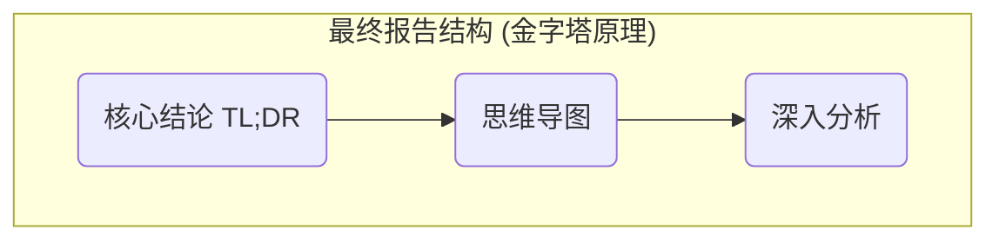
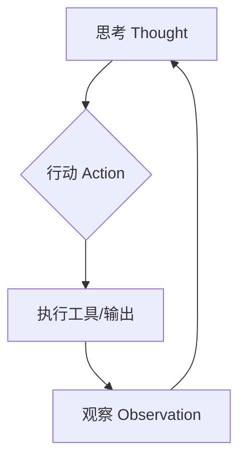
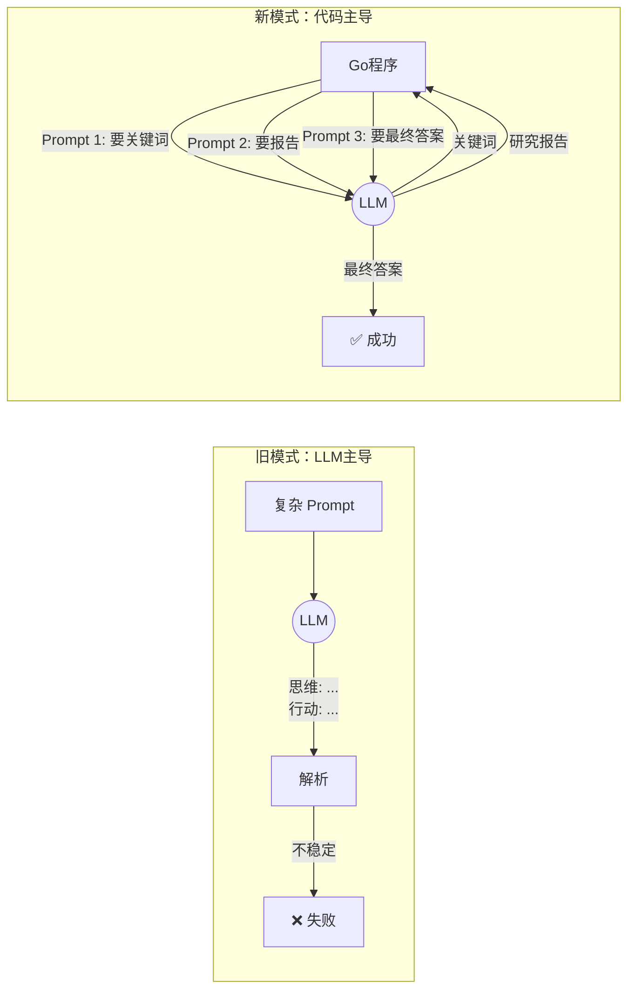

> 在 AI 如此强大的今天，**足够清晰聚焦的目标、一条迭代演进的路线，才是我们不至于在技术的浪潮中翻车的压舱石。**

<!--more-->

## 一、超级学习助手缘起与效果

### 1.1、背景

最近我正在学习 AI 领域大热的 ReAct 思想，它强调了“思考+行动”的循环。但是我不想仅仅停留在理论上学习，而是尝试通过实战的方式加深学习。

当下我有一个痛点-- 我想深入学习一些框架知识或者源码（例如 Gin, Golang），但是直接啃源码效率比较低；使用大模型直接问他每次的回答又过于发散，因此我期望通过 ReAct 构建一个“架构师”级别的超级学习助手，每次能够给我专家级别的指导，AI 高效辅助我学习。

### 1.2、目标

理想中的学习助手，当我向它提问时，例如“Gin 的中间件是如何实现的？”，我期望得到的是一份**专家级的分析报告**。这份报告应该：

1.  **结论先行**: 直接告诉我核心答案。
2.  **结构清晰**: 像思维导图一样，让我对全貌一目了然。
3.  **深入浅出**: 用“费曼学习法”的思路，通过类比和场景让我快速理解。
4.  **授人以渔**: 不仅有结论，还有关键的伪代码和源码位置，引导我自己去探索。
5.  **自动归档**: 每次的问答都自动生成一份 Markdown 文件。

### 1.3、效果

经过一番探索和迭代，我最终实现了一个命令行工具。



当我运行它时，它会像下面这样工作：

```bash
# 提出我的问题
$ go run . -q "请深入讲解一下 Gin 框架的中间件是如何实现的"

# 程序开始像一个真正的专家一样，分阶段思考和行动
╔════════════════════════════════════════════════════════════╗
║          Go 源码架构师 (三阶段专家模式)                        ║
╚════════════════════════════════════════════════════════════╝
========================================
任务：请深入讲解一下 Gin 框架的中间件是如何实现的
========================================

--- 阶段 1: 信息规划师 ---
思考：为了深入回答这个问题，我需要从哪些角度和技术点进行分析？
行动：规划出以下核心关键词 -> [ Gin, Middleware, HandlersChain, Context, Next(), ... ]

--- 阶段 2: 知识提炼师 ---
思考：基于这些关键词，我脑中的知识库能整理出一份怎样的核心知识摘要？
行动：生成了核心技术研究报告。 (内容省略)

--- 阶段 3: 架构师与表达者 ---
思考：现在我拥有了问题的核心关键词和一份深度研究报告，可以开始撰写最终的专家级回答了。
✅ 任务完成

# 在控制台输出报告预览
================ 最终回答 (预览) ==================
**核心结论 (TL;DR)**
Gin 的中间件本质上是一个函数调用链（`HandlersChain`），通过共享一个包含执行位置指针（`index`）的 `Context` 对象，并利用 `c.Next()` 方法驱动指针移动和函数递归调用，从而实现了洋葱式的“请求前”和“请求后”处理逻辑。
... (内容已保存到 .md 文件)
====================================================

--- 行动：保存报告 ---
报告已成功保存到文件: Gin框架中间件原理核心说明.md
```
[超级学习助手 Github 链接](https://github.com/wsqyouth/tech_note/tree/master/ReAct_study/react_assistant_v3):  可直接使用，仅依赖 Google API Key


## 二、实现之旅

### 2.1 什么是 ReAct？—— 让 AI “手脑并用”

ReAct 是一种将推理（Reasoning）和行动（Acting）结合的 AI 智能体范式，通过 **"思维 → 行动 → 观察"** 的循环迭代，逐步完成复杂任务。



它和平常的 LLM 大模型有什么不一样呢？传统的 LLM 通过一系列推理直接完成任务，而 ReAct 显著的特点是 Reasoning + Act (即 “思考+行动”），也就是说，它通过一些推理、行动和反馈完成（就像人学习东西一样：思考方方案、试错、迭代），这种清晰可控将复杂任务的思考与行动外显，不再是黑盒子，而是透明的白盒。


### 2. 第一步：打造一个“无依赖”的 ReAct 框架

在接入要付费的大模型 API 之前，我们参考了腾讯云公众号文章，使用**纯 Go 语言模拟** 整个 ReAct 的框架模型，让我们对整个框架有一个核心的认知。

我们创建了一个 `react_demo.go`，里面的 “LLM” 只是固定 Mock 的数据。

*   **核心收获**: 这个“沙盘推演”的阶段，让我们能完全专注于 ReAct 流程本身的设计，定义出清晰的接口和循环逻辑，而不会被网络、API Key 等细节分散精力。**先用代码把骨架搭对，是后续所有工作的基础。**

````
┌─────────────────────────────────────────────┐
│           ReAct Core Loop                   │
│  (TAO循环调度 + 上下文管理 + 任务控制)           │
└─────────────────┬───────────────────────────┘
                  │
         ┌────────┴────────┐
         │                 │
    ┌────▼────┐      ┌────▼────┐
    │  LLM    │      │  Tools  │
    │ 模拟器   │      │  工具层  │
    └─────────┘      └────┬────┘
                          │
              ┌───────────┴───────────┐
              │                       │
         ┌────▼─────┐          ┌─────▼────┐
         │ Flight   │          │ Flight   │
         │ Search   │          │ Book     │
         └──────────┘          └──────────┘
````


#### **工具封装层（Tool Layer）**
- `BaseTool` 接口：定义工具的标准化调用规范
- `FlightSearchTool`：航班查询工具
- `FlightBookTool`：航班预订工具

#### **上下文管理器（Context Manager）**
- 存储 TAO 历史轨迹
- 智能裁剪超长上下文（保留近期3轮 + 早期摘要）
- 生成 LLM 可理解的上下文字符串

 **LLM 模拟器（Simulated LLM）**

- 根据任务类型和当前步骤生成预设的思维和行动
- 模拟真实 LLM 的推理过程
- 支持 Good/Bad Example 的不同响应策略

 **ReAct 核心循环（Core Loop）**

- 控制 TAO 迭代流程
- 解析 LLM 输出的思维和行动
- 调用工具并更新上下文
- 处理任务完成和超时终止

[ReAct Demo Github 链接](https://github.com/wsqyouth/tech_note/tree/master/ReAct_study/react_demo_v1) : 无任何外部依赖，主要用于学习 ReAct 框架思想。

### 3. 第二步：用真实的 Gemini API 替换掉模拟 “LLM”

这里我使用了 Google API Key，同时使用最新出的大模型："gemini-3-flash-preview"。将上一阶段 LLM 模拟器替换掉，实现真正的智能助手。

在这个过程中，我的主要踩坑点：

1. 调用 Google API SDK 失败。原因是大模型不知道 Googel SDK 的函数原型，我提供多次的源码也以失败而告终。最后我直接提供了官方 API 源码示例。

2. 过于热情的 LLM。本次我想通过 ReAct 模型一步一步让 LLM 思考拆解问题，但是大模型根据 Prompt 直接在第一轮思考中就输出答案，过于热情。因此我重新设计了三层 Prompt ，让他一步一步回答思考

**顿悟与架构升级：从“引导”LLM，到“掌控”LLM。**:

这次失败让我意识到，不能把流程控制权完全交给 LLM，必须夺回主导权。于是，我设计了**“三阶段专家流水线”**的全新架构。由 Go 程序担任“总指挥”，用三个不同但目标单一的 Prompt，去“命令”LLM 在每个阶段只做一件事（比如“只返回关键词”或“只写最终报告”）。
也就是说：让代码负责流程的确定性，让 LLM 负责每个步骤的创造性。



### 三、 展望：真正“联网”智能体

最终的版本只使用了“ `GEMINI_API_KEY`”，，为了减少外部依赖，知识来源完全依赖于 LLM 自身。

但我们已经构建了一个极其优雅的架构。由于我们将所有工具都抽象成了 `BaseTool`，未来我们只需要再创建一个 `RealSearchTool`，并为它配置一个真实的搜索 API Key，就可以在不改动主体流程的情况下，让这个 Agent 拥有访问互联网实时信息的能力，成为一个真正完全体的 ReAct 学习助手。


## 四、总结

这段从 0 到 1 的旅程，最重要的收获不是这个工具本身，而是设计这样一个产品的经验：没有一开始就设计一个大而全的系统，而是在一个清晰的目标下，从一个最小的模拟器开始，不断引入变量、遭遇问题、调整架构、精炼细节，最终才抵达了终点。


## 📚 参考资料

- [ReAct 论文](https://arxiv.org/abs/2210.03629): "ReAct: Synergizing Reasoning and Acting in Language Models"
- [LangChain ReAct 文档](https://python.langchain.com/docs/modules/agents/agent_types/react)
- [Agent 全面爆发，一文搞懂背后的核心范式 ReAct](https://mp.weixin.qq.com/s/YQfqLoL1Z94yx9z48CE8bQ) 腾讯云开发者